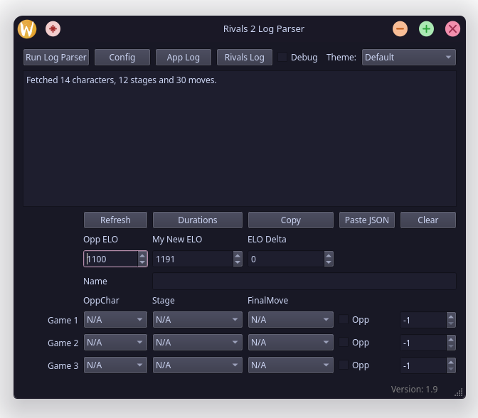

# lolhi

## Requirements

1. [GUI for Logging](https://github.com/sillypears/rivals2-log-parser)
2. [Backend](https://github.com/sillypears/rivals2-elo-backend)
3. [Frontend](https://github.com/sillypears/rivals2-elo-frontend)

## Usage

1. From code
  1. Enter virtual env
  1. `python3 main.py`

2. Build to EXE (Windows)
   1. `pyinstaller --onefile --windowed --icon=icon.ico --add-data "config.ini;." --add-data "icon.png;." main.py`

3. Build to binary (Linux)
   1. `python build_linux.py build`